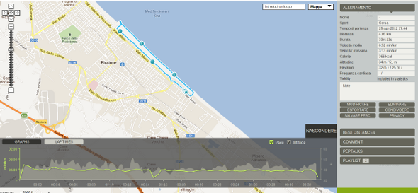
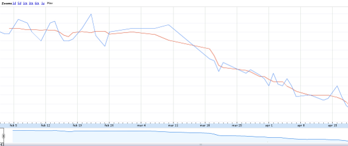

*data: 2013-03-22*

Obiettivo raggiunto
===================

*Il 30 aprile 2012 scrissi sul blog [A better Mundi](http://www.abettermundi.com/) il seguente
[articolo](http://www.abettermundi.com/2012/04/obiettivo-raggiunto/). Lo trascrivo qua, ora che ho
anche io un blog, perché mi era piaciuto molto e perché celebrava un piccolo grande successo di cui
vado piuttosto fiero.*
*Eccolo qua…*

---

Ho perso 5kg ed ho raggiunto il mio obiettivo entro la data stabilita.

***Le cose stanno così***

Qualcuno dirà “E che ci vuole?”. Qualcun’altro invece “Come hai fatto? Io sono anni che ci provo”.
Il problema è che i primi non capiscono che ciò che per loro è stato facile per altri può sembrare
un’impresa **impossibile**, e che i secondi chiedono consiglio a chi ci è riuscito, ossia i primi.

La verità è che i secondi sono tanti, **tantissimi**. La verità è che se sei uno dei secondi e alla
fine raggiungi il tuo obiettivo, tu hai affrontato un’impresa, tu non ti sei arreso, tu hai
sofferto, ti sei sentito frustrato, tu hai affrontato un problema che credevi **irrisolvibile** e
l’hai risolto, hai trovato il modo di risolverlo.

Chi ce l’ha fatta al primo tentativo **evidentemente** non aveva un problema da risolvere, ha
semplicemente eseguito un’azione che era già in grado di eseguire, non ha imparato niente, non ha
combattuto, ha “vinto facile”.

Io faccio parte dei secondi.

***Il Problema***

Nel 2006 ero sovrappeso di più di 15kg. Un amico dopo alcuni giorni di snowboard insieme nei quali
ero sempre l’ultimo a ripartire, mi fece notare che mi ero lasciato un po andare, forse per via
della laurea.

Perderne 10 non è stato difficile. E’ bastato smettere di mangiare pastarelle a colazione, non
mettevo più lo zucchero nel cappuccino, ho cominciato a dire no a chi mi invitava a cenare fuori 2
volte a settimana. Sport? Un po’ in più forse. Niente di difficile, ho solo rimosso cattive
abitudini di cui non avevo bisogno, facili da perdere. Non so neanche se è stato solo questo, non
me lo ricordo, è stato **facile**.

Purtroppo 2-3 anni fa mi sono assestato intorno a +5kg. Quello che facevo gratis non bastava più.
Allora ho provato con la dieta ipocalorica, ma non riuscivo a seguirla per più di 2 settimane, e
provavo ad andare a correre ma era noioso e portava via tempo che mi serviva per altro. Provavo a
tracciare il mio peso per tenere l’attenzione su quello che mangiavo (carne e verdura quanta ne
vuoi, occhio con carboidrati, etc.). Avevo preso dieci ingressi in piscina con l’idea che “li ho
pagati, adesso li faccio”, li ho esauriti l’altro giorno dopo 3 anni. Niente da fare.

***La Soluzione***

Cosa è cambiato?
Cosa ho scoperto? :)
L’ho trasformata in un **gioco**. E adesso vi dico come ho fatto, così che anche voi possiate
costruire il vostro gioco personale.

Per rendere divertente la **corsa** ne dovevo fare poca per volta, se no mi annoiavo. Andare insieme
ad altri non mi aiutatava. Un bel giorno è arrivato **Android** nella mia vita e con lui
**Endomondo**. Tracciare il percorso fatto e vederlo su Google Maps, sapere più o meno quante
calorie avevo consumato (gli hamburger bruciati, i giri del modo fatti, etc.) trasformava la corsa
in un gioco. Inoltre potevo comparare la fatica fatta con lo sfizio di un bombolone, comfrontare le
entrate con le uscite, come in un gioco manageriale.
Condividere queste informazioni su **Facebook** e vedere i “Mi piace” degli amici che
silenziosamente dicevano “Grande Dani, 6Km oggi?” mi dava una **carica motivazionale** non
irrilevante. La **tifoseria** è importante.
E poi più corri e meno diventa faticoso, sarà che ad oggi devo accelerare meno massa…

Da gennaio vivo da solo e dopo un breve periodo di sperimentazione in cucina ho ripreso quella
vecchia **dieta ipocalorica**. Ora potevo **pesare ogni cosa** poiché potevo **cucinare io quello
che mangiavo** e cucinarlo solo per me. Mi sono reso conto che il sapore della pasta in bianco non
è affatto male se ci metti un po’ di pepe e che se mando giù 250g di verdura a pasto arrivo alla
frutta che quasi non riesco a mangiarla da quanto sono pieno. Inoltre il pasto della domenica con
la tua famiglia acquisisce un sapore diverso, tutto è così buono e speciale.

Pesando TUTTO quello che mangi ti vien da chiederti come sia possibile essere sazi e continuare a
dimagrire e così ti rendi conto che **il nostro stomaco ha una capacità volumetrica** (cm o litri)
non calorica e che la domanda da farsi non è “quante calorie sto ingerendo?” ma “qual’è la densità
calorica di questo alimento”. Quindi comincerai a guardare le **calorie per 100g** ( o per 10cl) di
alimento e ti renderai conto che è il solo numero di cui hai bisogno. Io ho trovato questo sito per
farmi un’idea generica [http://www.calorie.it/](http://www.calorie.it/) . Per tutto il resto questo
numero c’è praticamente su ogni confezione di prodotto. Abbiamo gratis un **sistema di punteggio**.

Importante è **tracciare il peso, registrare i progressi**. Questa sarà la vostra **classifica**. Io
uso un Google Documents (adesso Drive), un foglio di lavoro. Quando sei preso dallo sconforto perché
il tuo ultimo peso è maggiore di quello di due giorni fa vedere da un grafico che comunque
nell’ultimo mese il trend è comunque positivo, ti risolleva il morale e ti spinge a non mollare. Non
è assolutamente vero che dovreste pesarvi una volta a settimana. Questo lo dicono perché una
rilevazione giornaliera è troppo fluttuante per essere leggibile ad occhio nudo. Ma voi avete
bisogno di stare focalizzati ogni giorno e pesarvi vi aiuterà. Fatelo quasi tutti i giorni E mettete
questi dati in uno stylesheet, guardate il grafico generato ed ignorate il vostro peso odierno.

Una **condizione di vittoria** è fondamentale. Ad esempio la mia era questa: Se pesandoti una
mattina appena sveglio, con il pigiama addosso, ma senza pantofole, il tuo peso è inferiore di x Kg
e la data di scadenza non è ancora passata, allora hai vinto! “E ma se i tuoi pigiami hanno peso
differente” direte voi. Io rispondo “la condizione di vittoria non contempla questa variabile” come
in una partita di calcio “la condizione di vittoria non contempla la bravura dell’arbitro”.

Sentirete dirvi più spesso “Ma sei dimagrito”. **Ringraziateli**. Si, lo so, stanno constatando
l’evidenza, ma quel che conta è che vi stanno motivando, vi stanno mettendo di **buon umore**, vi
stanno dando un **feedback positivo**. E poi noi ci vediamo tutti i giorni, loro invece ci vedono
più raramente e notano meglio la differenza. Per quanto ci sembri sbagliato daremo sempre importanza
al giudizio degli altri, forse più che ai numeri. Anche se già lo dice il nostro grafico sentirselo
confermare dalle persone ci aiuterà a credere di potercela fare ed è **quello che ci serve**.

Alla fine di tutto, fermatevi un attimo e, come sto facendo io, **scrivete**, descrivete quello che
avete fatto, **cosa avete appreso**, come l’avete fatto e **condividetelo con gli altri**: ciò che
avete scoperto può essere utile ad altri e a voi in futuro quando vi sarete dimenticati di questa
vittoria e starete combattendo un’altra battaglia che vi sembra impossibile.

***Cosa farò adesso***

Innanzi tutto **festeggerò**. Credo che mi sparerò una cena al Thailandese o al Giapponese.
E poi, **il gioco deve continuare**. Il gioco non è finito e non finirà mai. Ora che il grosso e
fatto devo controllare qual’è il mio peso forma e raggiungerlo, credo di dover perdere ancora
qualcosina.

***Infine***

Leggete ogni tanto gli articoli di questo blog
[http://www.efficacemente.com/](http://www.efficacemente.com/). Mi ha aiutato a vedere le cose sotto
un altro punto di vista. Purtroppo ancora alcuni concetti faccio fatica ad accettarli perché ho dei
preconcetti da rimuovere che vanno in conflitto con i nuovi. Tuttavia credo che piano piano leggere
questa roba stia addestrando la mia mente a pensare diversamente.

Usate [http://abmundi.com/](http://abmundi.com/), perché ABMundi nasce proprio per indurre tutti i
comportamenti di cui vi ho parlato nel vostro modo di porvi di fronte ad una sfida: Misurare,
feedback continuo, condividere con gli altri, vedere l’apprezzamento degli altri per quello che
stiamo facendo, focalizzazione sull’obiettivo, una scadenza, una condizione di vittoria.

Se siete arrivati a questo punto, vi ringrazio per l’attenzione. Volevo evitare di dirvi
semplicemente “dovete mangiare di meno e fare più sport” ma volevo dirvi quali strumenti ho
utilizzato io per aiutarmi a farlo, nella speranza che la sintesi dei miei pensieri possa esservi
utile in qualche modo.

Chi sono? Mi han detto di dire che sono un marinaio che sta su una nave della stessa flotta… in sala
macchine. :)

*Danilo, ABMundi Lead Developer*

---

*Pubblicato in Idee, Storie e contrassegnato come diet, idea, internet, life, running, sport,
story.*
